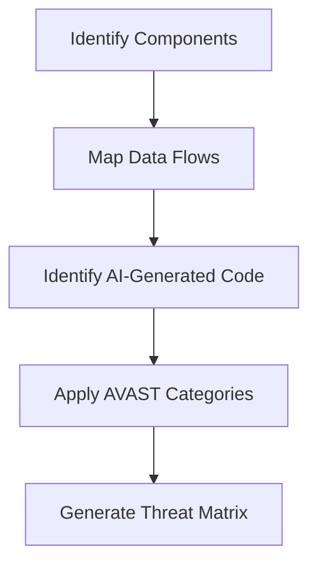

# The AVAST Framework: Complete Guide

## Executive Summary

AVAST is a threat modeling framework designed as a STRIDE+ extension specifically for AI-assisted software development. While STRIDE provides excellent general threat categorization (Spoofing, Tampering, Repudiation, Information Disclosure, Denial of Service, Elevation of Privilege), it's intentionally broad to cover all systems. Security practitioners have long used "STRIDE+" to append domain-specific threats they don't want to overlook.

AVAST represents the natural evolution of STRIDE+ for the AI era. You should absolutely continue using STRIDE for comprehensive threat modeling, but append AVAST to ensure you're addressing the specific, predictable vulnerability patterns that AI consistently introduces into generated code.

## Table of Contents
1. [AVAST as a Threat Modeling Framework](#avast-as-a-threat-modeling-framework)
2. [Background and Motivation](#background-and-motivation)
3. [Core Principles](#core-principles)
4. [The AVAST Components](#the-avast-components)
5. [Implementation Strategy](#implementation-strategy)
6. [Threat Modeling Process](#threat-modeling-process)
7. [Metrics and Measurement](#metrics-and-measurement)
8. [Case Studies](#case-studies)
9. [Advanced Topics](#advanced-topics)

## AVAST as a Threat Modeling Framework

### The Evolution from STRIDE to STRIDE+ to AVAST

**STRIDE** (developed by Microsoft) is the industry standard for threat modeling:
- **S**poofing identity
- **T**ampering with data
- **R**epudiation
- **I**nformation disclosure
- **D**enial of service
- **E**levation of privilege

**STRIDE+** emerged as practitioners needed domain-specific extensions:
- STRIDE + Cloud (adds multi-tenancy, shared responsibility)
- STRIDE + IoT (adds physical access, firmware updates)
- STRIDE + Mobile (adds device loss, app store threats)

**AVAST** is STRIDE+ for AI-generated code:
- **A**uthentication flaws (maps to Spoofing)
- **V**alidation gaps (maps to Tampering/Information Disclosure)
- **A**uditing deficiencies (maps to Repudiation)
- **S**ecrets exposure (maps to Information Disclosure)
- **T**rust boundary violations (maps to Elevation of Privilege)

### Why AVAST Complements STRIDE

STRIDE asks: "What can go wrong with this system?"
AVAST asks: "What will AI get wrong when building this system?"

Example threat modeling session:
1. Apply STRIDE to identify general threats
2. Apply AVAST to identify AI-specific vulnerabilities
3. Combine findings for comprehensive coverage

### Using STRIDE + AVAST Together

```yaml
threat_model:
  component: User Authentication Service

  stride_threats:
    spoofing:
      - Credential theft
      - Session hijacking
    tampering:
      - Password modification
      - Token manipulation

  avast_threats:
    authentication:
      - AI will likely implement MD5 hashing
      - AI won't implement rate limiting
      - AI will store passwords in logs
    validation:
      - AI will concatenate SQL queries
      - AI won't sanitize inputs

## Background and Motivation

### The AI Code Security Crisis

Recent studies reveal alarming statistics about AI-generated code:
- **45%** fail basic security tests (Veracode, 2025)
- **62%** contain formally verifiable vulnerabilities
- **72%** failure rate for Java applications
- **83%** of organizations use AI for production code

### Why Traditional Tools Fall Short

1. **Pattern Matching Limitations**: SAST/DAST tools produce overwhelming false positives without understanding AI generation context
2. **Missing Intent**: AI code lacks the security reasoning human developers apply
3. **Training Data Poisoning**: Models trained on vulnerable code perpetuate security anti-patterns
4. **Iteration Paradox**: Each AI refinement often introduces new vulnerabilities

## Core Principles

### 1. Context Over Scanning
Traditional tools identify symptoms; AVAST addresses root causes by providing security context before generation.

### 2. Proactive Over Reactive
Security requirements embedded in prompts prevent vulnerabilities rather than finding them post-generation.

### 3. Developer-Centric Design
Security measures that don't disrupt developer flow, making secure coding the path of least resistance.

### 4. Measurable Impact
Every control must demonstrate quantifiable security improvement.

## The AVAST Components

### 🔐 Authentication
**Focus**: Identity verification, session management, and access control

**Common AI Failures**:
- Hardcoded credentials in examples
- Weak password policies
- Session fixation vulnerabilities
- Missing MFA implementation
- Improper session timeout handling

**AVAST Controls**:
```yaml
authentication:
  requirements:
    - Use bcrypt/argon2 for password hashing
    - Implement session regeneration on login
    - Rate limit authentication attempts
    - Never log credentials
    - Implement secure password reset flow

  forbidden_patterns:
    - Hardcoded credentials
    - MD5/SHA1 for passwords
    - Predictable session tokens
    - GET requests for authentication
```

### ✅ Validation
**Focus**: Input sanitization, data validation, and output encoding

**Common AI Failures**:
- SQL injection vulnerabilities
- XSS through improper encoding
- Command injection
- Path traversal
- Buffer overflows
- Regex DoS

**AVAST Controls**:
```yaml
validation:
  requirements:
    - Parameterized queries only
    - Whitelist input validation
    - Context-aware output encoding
    - Length and type validation
    - Sanitize file uploads

  forbidden_patterns:
    - String concatenation for queries
    - Direct HTML rendering of user input
    - eval() or equivalent functions
    - Unrestricted file operations
```

### 📊 Auditing
**Focus**: Logging, monitoring, and forensics capabilities

**Common AI Failures**:
- Logging sensitive data (passwords, PII, tokens)
- Insufficient security event logging
- Missing correlation IDs
- No log integrity protection
- Verbose error messages to users

**AVAST Controls**:
```yaml
auditing:
  requirements:
    - Log security events (auth, authz, validation)
    - Implement correlation IDs
    - Sanitize logs of sensitive data
    - Rate limit log generation
    - Separate security and debug logs

  forbidden_patterns:
    - Logging passwords or tokens
    - User-facing stack traces
    - Unstructured log formats
    - Missing timestamps
```

### 🔑 Secrets
**Focus**: Credential management, encryption, and key storage

**Common AI Failures**:
- Hardcoded API keys
- Secrets in comments
- Plaintext storage
- Weak encryption algorithms
- Keys in version control

**AVAST Controls**:
```yaml
secrets:
  requirements:
    - Environment variables for secrets
    - Encryption at rest for sensitive data
    - Secure key rotation mechanism
    - Use vetted crypto libraries
    - Implement secret scanning

  forbidden_patterns:
    - Hardcoded secrets
    - Custom crypto implementations
    - Secrets in logs or errors
    - Weak algorithms (DES, MD5)
```

### 🛡️ Trust
**Focus**: Authorization, boundaries, and privilege management

**Common AI Failures**:
- Missing authorization checks
- Client-side security controls
- Privilege escalation paths
- Insecure direct object references
- Trust boundary violations

**AVAST Controls**:
```yaml
trust:
  requirements:
    - Server-side authorization for all operations
    - Principle of least privilege
    - Validate trust boundaries
    - Implement proper CORS policies
    - Use secure defaults

  forbidden_patterns:
    - Client-side authorization
    - Unrestricted admin functions
    - Missing boundary validation
    - Overly permissive CORS
```

## Implementation Strategy

### Phase 1: Assessment (Days 1-5)
1. **Inventory AI Usage**
   ```bash
   # Find AI-assisted code
   git log --grep="copilot\|claude\|cursor" --all
   git grep -l "AI-generated\|Generated by\|Copilot"
   ```

2. **Baseline Security Posture**
   - Run existing security scans
   - Document current vulnerability rates
   - Identify AI-heavy components

3. **Gap Analysis**
   - Map vulnerabilities to AVAST categories
   - Identify pattern clusters
   - Prioritize high-risk areas

### Phase 2: Integration (Days 6-15)

1. **Tool Configuration**
   ```bash
   # Add to all AI assistant configs
   for file in .cursorrules .claude .github/copilot-instructions.md; do
     cat avast-rules.md >> $file
   done
   ```

2. **Git Hooks Setup**
   ```bash
   #!/bin/bash
   # .git/hooks/pre-commit

   # Check for AVAST compliance
   if ! grep -q "AVAST" .cursorrules 2>/dev/null; then
     echo "❌ AVAST rules not found in .cursorrules"
     exit 1
   fi

   # Scan for common vulnerabilities
   ./scripts/avast-scan.sh
   ```

3. **CI/CD Pipeline**
   ```yaml
   # .github/workflows/avast-security.yml
   name: AVAST Security Check
   on: [push, pull_request]

   jobs:
     avast-scan:
       runs-on: ubuntu-latest
       steps:
         - uses: actions/checkout@v2
         - name: Run AVAST validation
           run: |
             ./scripts/validate-avast.sh
             ./scripts/security-scan.sh
         - name: Check AI patterns
           run: |
             python scripts/ai-pattern-detector.py
   ```

### Phase 3: Enforcement (Days 16-30)

1. **Metrics Collection**
   - Vulnerability discovery rate
   - Time to remediation
   - False positive rate
   - Developer satisfaction

2. **Continuous Improvement**
   - Weekly security reviews
   - Pattern library updates
   - Tool tuning based on findings

## Threat Modeling Process

### Step 1: Component Mapping


### Step 2: Threat Identification

| Component | AVAST Category | Potential Threats | Risk Level |
|-----------|---------------|-------------------|------------|
| Login API | Authentication | Brute force, credential stuffing | High |
| User Input | Validation | SQL injection, XSS | Critical |
| Error Handler | Auditing | Information disclosure | Medium |
| Config Loader | Secrets | Hardcoded credentials | High |
| Admin Panel | Trust | Privilege escalation | Critical |

### Step 3: Mitigation Planning

For each identified threat:
1. Define specific security requirements
2. Create test cases
3. Implement controls
4. Verify effectiveness

## Metrics and Measurement

### Key Performance Indicators (KPIs)

1. **Vulnerability Density**
   ```
   VD = Vulnerabilities / KLOC (pre-AVAST vs post-AVAST)
   Target: 50% reduction in 30 days
   ```

2. **Mean Time to Remediation (MTTR)**
   ```
   MTTR = Σ(Time to fix) / Number of issues
   Target: 40% improvement
   ```

3. **Security Debt Ratio**
   ```
   SDR = Security fix time / Development time
   Target: < 15%
   ```

### Reporting Dashboard

```yaml
weekly_metrics:
  vulnerabilities:
    critical: 2 (-60% WoW)
    high: 5 (-40% WoW)
    medium: 12 (-20% WoW)

  ai_patterns:
    sql_injection: 0 (-100%)
    hardcoded_secrets: 1 (-80%)
    missing_validation: 3 (-70%)

  developer_metrics:
    prompts_with_avast: 89%
    security_training_completion: 95%
    satisfaction_score: 4.2/5
```

## Case Studies

### Case Study 1: E-Commerce Platform
**Challenge**: 200+ vulnerabilities in AI-generated checkout flow

**AVAST Implementation**:
- Added validation rules to AI prompts
- Implemented pre-generation threat modeling
- Created secure code templates

**Results**:
- 75% reduction in vulnerabilities
- 50% faster security review process
- Zero critical issues in production

### Case Study 2: Financial Services API
**Challenge**: Compliance failures due to insufficient auditing

**AVAST Implementation**:
- Enhanced auditing requirements in AI instructions
- Automated compliance checking
- Security-first prompt engineering

**Results**:
- 100% audit compliance achieved
- 60% reduction in remediation costs
- Passed regulatory review first attempt

## Advanced Topics

### AI Model Training
Considerations for organizations training custom models:
1. Curate secure training datasets
2. Implement adversarial testing
3. Regular model security audits
4. Version control for model iterations

### Prompt Engineering for Security
```python
# Secure prompt template
secure_prompt = """
Generate a {function_type} that:
1. Validates all inputs against: {validation_rules}
2. Implements authentication: {auth_requirements}
3. Logs security events: {audit_requirements}
4. Never: {forbidden_patterns}

Security context: {threat_model}
"""
```

### Integration with Security Tools

1. **SAST Integration**
   ```yaml
   avast_sast_rules:
     - id: avast-auth-001
       pattern: "password.*=.*['\"]"
       message: "Hardcoded password detected"
       severity: critical
   ```

2. **IDE Plugins**
   - Real-time AVAST validation
   - Security suggestions during coding
   - Threat modeling assistance

### Future Directions

1. **Machine Learning Enhancement**
   - Pattern recognition for novel vulnerabilities
   - Automated threat model generation
   - Predictive security analytics

2. **Community Collaboration**
   - Shared vulnerability database
   - Crowd-sourced secure patterns
   - Industry-specific adaptations

## Conclusion

The AVAST Framework represents a paradigm shift in securing AI-generated code. By focusing on proactive threat modeling rather than reactive scanning, organizations can harness the productivity benefits of AI while maintaining robust security postures.

Remember: **Your AI doesn't know what it doesn't know about security. AVAST provides the context it needs.**

## Additional Resources

- [AVAST GitHub Repository](https://github.com/CEA-Brad/avast-toolkit)
- [Security Patterns Library](./patterns/)
- [Integration Guides](./integrations/)
- [Community Forum](https://github.com/CEA-Brad/avast-toolkit/discussions)

---

*Last Updated: 2025*
*Version: 1.0.0*
*Author: Brad Tenenholtz*